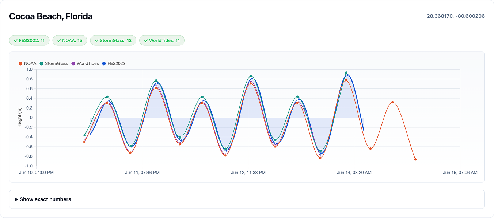
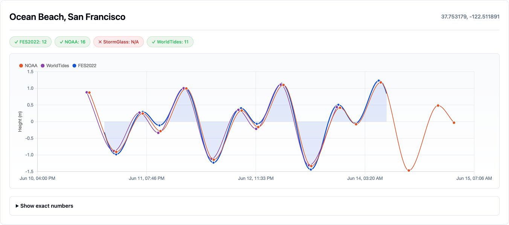
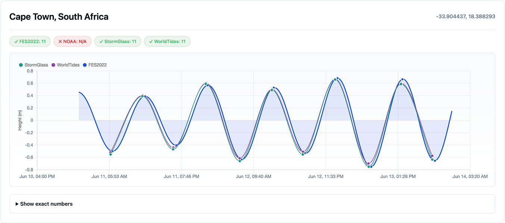

# Sun Moon Tides

Sun Moon Tides is a REST API for tide predictions and astronomy data that works anywhere in the world. Just provide latitude and longitude coordinates for any point in the ocean and get back accurate predictions.

## What's New — 2026-06-11

This release migrates the tide engine to the new FES2022b native grid and hardens the public API:

- **Much better accuracy near the coast**: predictions now run on a fine mesh that follows the real shape of coastlines (500 m to 4 km resolution near shore), instead of the old coarse regular grid. This fixes timing errors of up to 1–4 hours in harbors, estuaries, and shallow bays.
- **34 tidal constituents** (up from 24): constituents are the individual astronomical "waves" (from the Moon, the Sun, and their cycles) that add up to the tide. The 10 new ones capture subtler effects — like how tides get distorted in shallow water and slow cycles spanning weeks — making predicted times and heights more accurate, especially in complex coastal areas.
- **Zero per-request disk I/O**: all tide data is loaded into memory once at startup (~8 GB RAM, ≥16 GB recommended in production), eliminating the slowness and timeouts caused by reading from disk on every request.
- **New comparison dashboard** (`/api/v1/comparison`): tide curve charts comparing our predictions against NOAA, WorldTides, and StormGlass for 17 global locations, with exact timing/range tables.
- **Rate limiting**: the three public endpoints are now limited to 240 requests/minute per IP.
- **New tests**: native-grid interpolation tests that run without the data file, comparison tests, and a `requires_grid` marker so grid-backed tests skip cleanly when the 3.7 GB data file isn't available.

---

## Overview

The API provides three endpoints:

- **`/api/v1/tides`** - High and low tide times with heights. Optionally returns tide heights at regular intervals (15, 30, or 60 minutes) for plotting tide curves. Supports different tidal datums (MSL, MLLW, LAT).

- **`/api/v1/sun-moon`** - Daily sunrise and sunset times, civil dawn and dusk, moonrise and moonset times, moon phase name and illumination percentage.

- **`/api/v1/sun-moon-tides`** - Combined endpoint that returns both tide and astronomy data in a single request.

All times are automatically returned in the local timezone for the requested coordinates.

**Use cases:** surf and fishing apps, marine navigation tools, coastal activity planning, photography apps (golden hour, moon phases), sailing and boating applications, beach safety information, scientific research, or any application that needs tide or sun/moon data without per-request API costs.

## Quick Start

```bash
source venv/bin/activate
pip install -r requirements.txt
export FES_DATA_PATH=/path/to/fes2022b-data
uvicorn app.main:app --reload
```

`FES_DATA_PATH` must point at the directory containing `FES2022b_OceanTide_NSgrid.nc`.
API docs at http://localhost:8000/docs

## API Reference

All public endpoints are rate-limited to **240 requests/minute per IP**. Exceeding the limit returns `429 Too Many Requests`.

### GET `/api/v1/tides`

Returns high/low tide predictions for a location.

**Parameters:**

| Parameter | Type | Required | Default | Description |
|-----------|------|----------|---------|-------------|
| `lat` | float | yes | - | Latitude (-90 to 90) |
| `lon` | float | yes | - | Longitude (-180 to 180) |
| `days` | int | no | 7 | Number of days (1-365) |
| `start_date` | string | no | today | Start date in ISO format (YYYY-MM-DD) |
| `interval` | string | no | - | Return heights at intervals: `"15"`, `"30"`, or `"60"` minutes. If omitted, returns only high/low events. |
| `datum` | string | no | `"msl"` | Tidal datum: `"msl"` (Mean Sea Level), `"mllw"` (Mean Lower Low Water), or `"lat"` (Lowest Astronomical Tide) |

**Example:**
```bash
curl "http://localhost:8000/api/v1/tides?lat=34.03&lon=-118.68&days=7"
```

**Response:**
```json
[
  {"type": "low",  "datetime": "2025-12-22T03:26:34-08:00", "height_m": -0.083, "height_ft": -0.27, "datum": "msl"},
  {"type": "high", "datetime": "2025-12-22T09:34:33-08:00", "height_m": 0.921,  "height_ft": 3.02,  "datum": "msl"},
  {"type": "low",  "datetime": "2025-12-22T16:58:25-08:00", "height_m": -1.041, "height_ft": -3.42, "datum": "msl"}
]
```

---

### GET `/api/v1/sun-moon`

Returns sun and moon data for a location.

**Parameters:**

| Parameter | Type | Required | Default | Description |
|-----------|------|----------|---------|-------------|
| `lat` | float | yes | - | Latitude (-90 to 90) |
| `lon` | float | yes | - | Longitude (-180 to 180) |
| `days` | int | no | 7 | Number of days (1-365) |
| `start_date` | string | no | today | Start date in ISO format (YYYY-MM-DD) |

**Example:**
```bash
curl "http://localhost:8000/api/v1/sun-moon?lat=34.03&lon=-118.68&days=3"
```

**Response:**
```json
[
  {
    "date": "2025-12-23",
    "civil_dawn": "2025-12-23T06:29:38-08:00",
    "sunrise": "2025-12-23T06:57:26-08:00",
    "solar_noon": "2025-12-23T11:54:17-08:00",
    "sunset": "2025-12-23T16:50:09-08:00",
    "civil_dusk": "2025-12-23T17:17:57-08:00",
    "moonrise": "2025-12-23T09:46:57-08:00",
    "moonset": "2025-12-23T19:19:14-08:00",
    "moon_phase": "Waxing Crescent",
    "moon_phase_angle": 44.3,
    "moon_illumination": 18
  }
]
```

---

### GET `/api/v1/sun-moon-tides`

Returns both tide and sun/moon data in a single request.

**Parameters:**

| Parameter | Type | Required | Default | Description |
|-----------|------|----------|---------|-------------|
| `lat` | float | yes | - | Latitude (-90 to 90) |
| `lon` | float | yes | - | Longitude (-180 to 180) |
| `days` | int | no | 7 | Number of days (1-365) |
| `start_date` | string | no | today | Start date in ISO format (YYYY-MM-DD) |
| `interval` | string | no | - | Return tide heights at intervals: `"15"`, `"30"`, or `"60"` minutes |
| `datum` | string | no | `"msl"` | Tidal datum: `"msl"`, `"mllw"`, or `"lat"` |

**Example:**
```bash
curl "http://localhost:8000/api/v1/sun-moon-tides?lat=34.03&lon=-118.68&days=7"
```

**Response:**
```json
{
  "sun_moon": [{"date": "2025-12-23", "sunrise": "...", "sunset": "...", ...}],
  "tides": [{"type": "high", "datetime": "...", "height_m": 0.92, ...}]
}
```

## Comparison Tool

Visual dashboard comparing Sun Moon Tides predictions against other tide providers (NOAA, WorldTides, StormGlass) for 17 global locations:

```
http://localhost:8000/api/v1/comparison
```

Useful for evaluating accuracy in different regions. Each location shows a FES2022b tide curve with external-provider high/low markers overlaid, plus exact timing/range numbers in a collapsed table.







## Python Usage

```python
from app.tide_service import FES2022TideService

service = FES2022TideService(data_path='./')
tides = service.predict_tides(lat=34.03, lon=-118.68, days=7)

for tide in tides:
    print(f"{tide['type'].upper():4} {tide['datetime']} {tide['height_ft']:+.2f}ft")
```

## Running Tests

```bash
pytest tests/ -v
```

Grid-backed tests are marked `requires_grid` and need `FES_DATA_PATH` plus enough RAM to load the native grid. The lightweight `tests/test_native_grid.py` tests the interpolation math without the 3.7 GB data file.

## Data Requirements

This project requires two data sources:

- `FES2022b_OceanTide_NSgrid.nc` - FES2022b native-grid tidal constituents (for tide predictions)
- `de421.bsp` - NASA JPL planetary ephemeris (for sun/moon calculations)

The `de421.bsp` file (~17 MB) contains precise positions of the Sun, Moon, and planets. Skyfield downloads it automatically on first run, or you can download it manually from [NASA JPL](https://naif.jpl.nasa.gov/pub/naif/generic_kernels/spk/planets/).

The native grid file is large (~3.7 GB on disk) and is eager-loaded at startup for zero per-request disk I/O. Plan for roughly 8 GB runtime memory locally and at least a 16 GB production server.

For Docker, mount the directory containing the `.nc` file and point `FES_DATA_PATH` at that mount:

```bash
docker run -e FES_DATA_PATH=/data -v /path/to/fes2022b-data:/data sun-moon-tides
```

### How to Download FES2022b Data

1. **Register on AVISO**: Go to [AVISO Registration](https://www.aviso.altimetry.fr/en/data/data-access/registration-form.html) and create an account. Select the product "FES (Finite Element Solution - Oceanic Tides Heights)".

2. **Wait for approval**: After registration, you'll receive login credentials by email once your account is validated.

3. **Download via FTP**: Connect to the AVISO FTP server using your credentials:
   - **Host**: `ftp-access.aviso.altimetry.fr`
   - **Protocol**: FTP or SFTP (port 2221 for SFTP)

   Download the native-grid ocean tide file:
   | File | Description |
   |------|-------------|
   | `FES2022b_OceanTide_NSgrid.nc` | Native unstructured finite-element grid with all 34 ocean tide constituents |

4. **Place files outside git**: Put the file in a local data directory and point `FES_DATA_PATH` there:
   ```
   /path/to/fes2022b-data/
   └── FES2022b_OceanTide_NSgrid.nc
   ```

The data is free for any use (including commercial) but requires [registration](https://www.aviso.altimetry.fr/en/data/data-access.html) and proper citation.

## Accuracy

This is a **global physics-based model**, not calibrated to local tide stations:
- **Timing accuracy**: Typically ±10-30 minutes; the FES2022b native grid improves difficult harbors, bays, and estuaries versus the old cartesian grid
- **Tidal range accuracy**: ±0.3m for consecutive high/low differences
- **Known limitations**: Strong local resonance, river effects, and station-specific datum differences can still make local tide gauges more precise

Use the comparison tool to see where Sun Moon Tides works well vs. poorly for your region.

## How Tides Work

Tides are caused by the gravitational pull of the Moon and Sun on Earth's oceans. As the Earth rotates, different parts of the ocean are pulled toward these celestial bodies, creating the rise and fall we observe at coastlines.

**The Moon's Role**: The Moon is the primary driver of tides. Even though the Sun is much larger, the Moon is much closer, making its gravitational effect on tides about twice as strong. This is why we typically see two high tides and two low tides each day (as the Earth rotates through the Moon's gravitational "bulge").

**The Sun's Role**: The Sun modulates the Moon's effect. When the Sun and Moon align (new moon and full moon), their forces combine to create stronger "spring tides." When they're at right angles (quarter moons), we get weaker "neap tides."

### How This Tool Calculates Tides

Rather than trying to simulate ocean physics in real-time, tide prediction uses **harmonic analysis** - a technique developed over centuries of observation.

**Tidal Constituents**: Scientists discovered that tides can be broken down into multiple overlapping waves, each caused by a specific astronomical cycle:

| Constituent | Period | Cause |
|------------|--------|-------|
| M2 | 12.42 hours | Moon's gravity (main lunar) |
| S2 | 12.00 hours | Sun's gravity (main solar) |
| K1 | 23.93 hours | Moon's declination |
| O1 | 25.82 hours | Moon's declination |
| N2 | 12.66 hours | Moon's elliptical orbit |

FES2022 uses **34 tidal constituents** to capture all major astronomical influences.

**How Prediction Works**: For any location, we know:
- **Amplitude**: How much each constituent affects that location (in cm)
- **Phase**: When each constituent's cycle peaks at that location

To predict the tide at any future time, we simply add up all these waves:

```
tide_height = Σ (amplitude × cos(frequency × time + phase))
```

This is why tide predictions can be accurate years in advance - they're based on predictable astronomical cycles.

### About FES2022

This service uses **FES2022** (Finite Element Solution 2022), a global ocean tide model developed by CNES (French space agency), LEGOS, NOVELTIS, and CLS.

Key characteristics:
- **Global coverage**: Works anywhere in the world's oceans
- **Native finite-element grid**: 11M triangles with roughly 500m-4km coastal resolution
- **34 tidal constituents**: Captures all major tidal frequencies
- **Satellite-validated**: Built using 28 years of satellite altimetry data (1992-2020)
- **Quadratic interpolation**: LGP2 interpolation on the native mesh instead of nearest-neighbour cartesian lookup

The model is physics-based and doesn't require local tide gauge calibration, which enables worldwide coverage but means predictions may be less precise than locally-calibrated services in complex coastal areas.

For more technical details, see the [FES2022 handbook](https://www.aviso.altimetry.fr/fileadmin/documents/data/tools/hdbk_FES2022.pdf).

The FES2022 Tide product was funded by CNES, produced by LEGOS, NOVELTIS and CLS and made freely available by AVISO.
